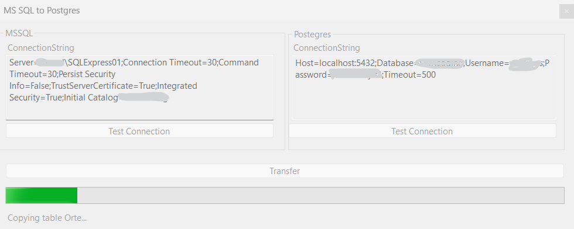

# MsSqlToPostgres

This tool migrates an MS SQL database to PostgreSQL seamlessly.

## Support

If this project help you, you can buy me a coffee :)

## Built With

* .NET 8.0
* Winforms

## Releases

You can download the latest version in [Releases](/releases)

## Getting Started

1. Open your MsSqlToPostgres
2. Enter the ConnectionString of your MS-SQL DB
3. Test the MS-SQL Connection
4. Enter the ConnectionString of your Postgres DB
5. Test the Postgres Connection
6. Click "Transfer"

## Authors

* **Stefan Potthoff** - *Initial work* - [Stefan Potthoff](https://github.com/StefanPotthoff)

## License

This project is licensed under the MIT License - see the [LICENSE](/blob/master/LICENSE) file for details
